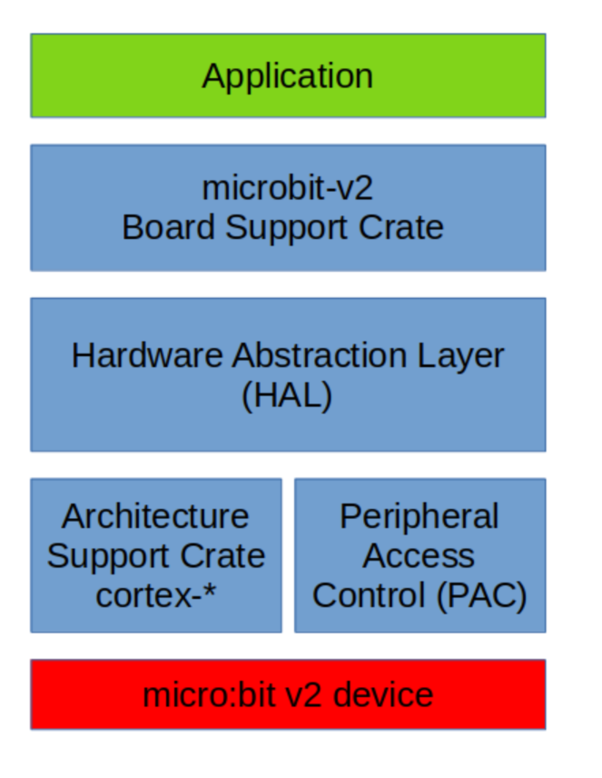

# Introduction to micro:bit v2

[microbit.org](https://microbit.org/) PLEASE USE only microbit v2(!)

* Nordic nRF52833 ARM Cortex-M4
* Peripherals on board:
   * 5x5 LED matrix,
   * Buttons,
   * GPIOs,
   * Accelerometer,
   * Bluetooth,
   * Crocodile Clips, Light Sensor, Speaker, Microphone, External Power,
   * etc.

# Live Demonstration

* Create Project
```sh
cargo generate microbit-rust-nostd \
   --name myproject
# or remote
cargo generate \
   --git https://github.com/br0kenpixel/microbit-rust-nostd
```
* Connect microbit USB-C cable
* Run (build and flash)

```sh
cargo run
```
# Setting up the Development Environment
 Platform specific parts
 <https://docs.rust-embedded.org/discovery/microbit/03-setup/index.html>

```bash
# rustup (rust version > 1.57)
rustc -V
# cargo-binutils
rustup component add llvm-tools-preview
cargo install cargo-binutils --vers 0.3.3
# cargo-embed
cargo install cargo-embed --vers 0.11.0
```
<!--
discovery the starting point for 
by ferrous-system (major player in the rust world
-->

# Rust Embedded Architecture



# Walkthrough of the Created Project

 * `.cargo/config` specifies runner, build target
 * `Embed.toml` configures gdb, rtt
 * `memory.x` describes where the RAM and FLASH are and their sizes
 * `build.rs` ensures `memory.x` is in out directory

# Walkthrough of the Created Project: `src/main.rs`
```rust
#![no_std] // core library
#![no_main] // custom entry point

use cortex_m_rt::entry;
use microbit::{board::Board, display::blocking::Display, hal::Timer};
use panic_rtt_target as _;
use rtt_target::{rprintln, rtt_init_print};

#[entry]
fn main() -> ! {
    rtt_init_print!();
    let board = Board::take().unwrap();
...
    loop {
        rprintln!("Hello!");
    }
}
```

<!--
#![no_std] indicates the core library is used (and not the std crate); this is based on bare metal
#![no_main] indicates a custom entry point is used (instead of the default main)
#[entry] defines the extry point (from cortex-m crate)
-->
# Examples in microbit Crate

```bash
git clone https://github.com/nrf-rs/microbit

# example: display blocking
cargo run --release \
   --features v2 --target thumbv7em-none-eabihf \
   --manifest-path ./examples/display-blocking/Cargo.toml

# example text with Real-Time Interrupt-driven Concurrency (RTIC) 
cargo run --release \
   --features v2 --target thumbv7em-none-eabihf \
   --manifest-path ./examples/display-text-rtic/Cargo.toml
```

# Testing Embedded Rest
Ferrous Article Serie "Testing an embedded application"
<https://ferrous-systems.com/blog/test-embedded-app/>

Whenever possible you should test your firmware code on the host.

# Debugging
Using GDB <https://docs.rust-embedded.org/discovery/microbit/05-led-roulette/debug-it.html>

`probe-rs` in vscode <https://probe.rs/docs/tools/vscode/>

# Ressources

<https://docs.rust-embedded.org/>
<https://github.com/rust-embedded/awesome-embedded-rust>
<https://docs.rust-embedded.org/discovery/microbit/>
<https://embedded-trainings.ferrous-systems.com>
<https://docs.rust-embedded.org/embedonomicon>

# Advanced Topics

* RTOS
* embassy: embedded async tools
* drogue-device 
   * <https://github.com/drogue-iot/drogue-device>
   * <https://book.drogue.io/drogue-device/dev/examples/nrf52/microbit/ble/README.html> 
     describes using Bluetooth on microbit for data and also supports updateing the firmware via Bluetooth

<!--
~/repositories_opensource/bluetooth/drogue-device/examples/nrf52/microbit/ble/src/main.rs
-->

